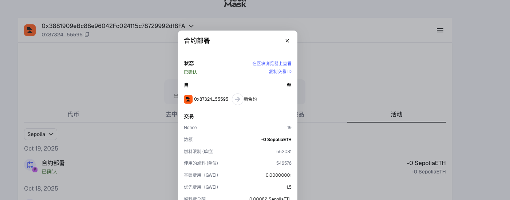
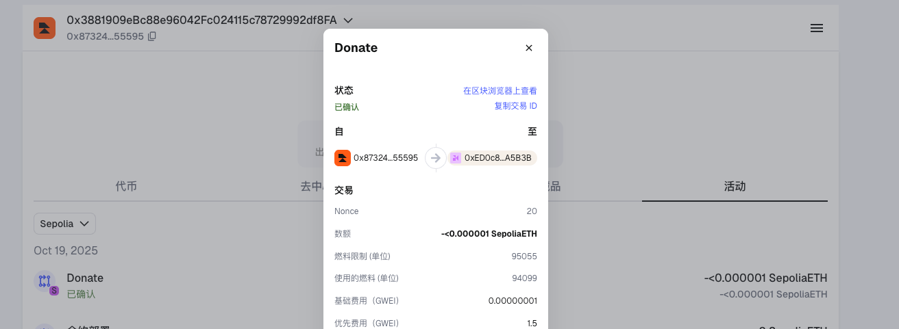
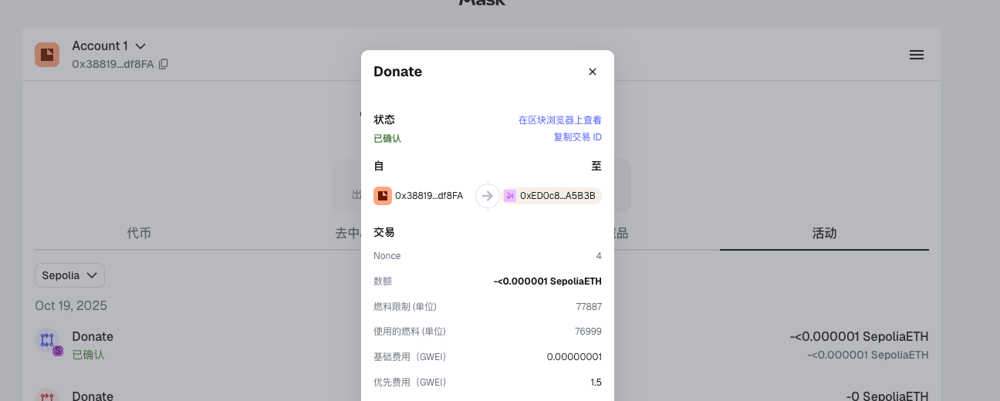
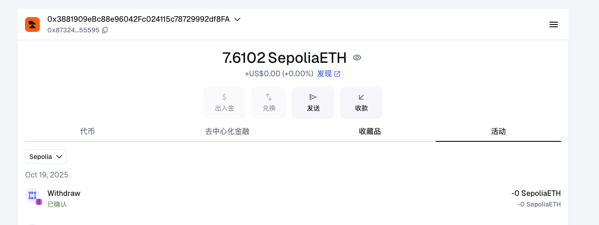

#### 以下是合约部署到MetaMask钱包的sepolia-testnet的效果：
**1. 部署合约**

**2. 合约地址**

0xed0c84b061eddccf6a514b98bee26a491f7a5b3b

**3. 捐赠:**

**etherscan地址:**

https://sepolia.etherscan.io/tx/0x6070cab7335781b282a673016673108eae3aa1bfec8ebefa07b71f004bfbffcb

**4.捐赠2:**

**etherscan地址：**

https://sepolia.etherscan.io/tx/0xee69b2f85ddb8817b67068b16aad1ad63e6f04b2dd529b1dbe5a21d802b1d94c

**5.取款:**

**etherscan地址：**

https://sepolia.etherscan.io/tx/0xb57f23d9eb00257747d9c31a66a2f9c366fbc8f79dab9e02a6344082d22a576f
